# Application Flow

## SkillSearchFit SEO AI Platform — MVP

| Field | Value |
|-------|-------|
| **Version** | MVP 2.0 |
| **Last Updated** | June 11, 2026 |
| **Supersedes** | App Flow v1.0 |

---

## 1. Purpose

This document maps end-to-end user journeys, system interactions, and navigation flows across the public site, authenticated application, admin portal, and plugin execution pipeline.

---

## 2. High-Level Site Map

```
SkillSearchFit
│
├── Public (Marketing)
│   ├── /                     Home (incl. "How it works")
│   ├── /features             Features
│   ├── /about                About
│   ├── /contact              Contact
│   ├── /login                User Login
│   └── /signup               User Signup
│
├── Application (User Auth)
│   ├── /dashboard            Dashboard
│   ├── /plugins               Plugin Library
│   ├── /workspace/[pluginId] Workspace
│   ├── /projects             Projects
│   ├── /projects/[id]        Project Detail
│   └── /profile              Profile
│
└── Admin Portal (Admin Auth)
    ├── /admin/login          Admin Login
    ├── /admin/dashboard      Admin Dashboard (platform stats)
    ├── /admin/users          User Management
    ├── /admin/plugins        Plugin Management
    ├── /admin/plugins/[id]   Plugin Builder / Edit
    ├── /admin/prompts        Prompt Management
    └── /admin/logs           Activity Logs
```

---

## 3. Actor Definitions

| Actor | Entry Point | Primary Goals |
|-------|-------------|---------------|
| Visitor | `/` | Learn about product, sign up |
| User | `/login`, `/signup` | Run SEO plugins, manage projects |
| Admin | `/admin/login` | Configure platform, manage users, monitor activity |

---

## 4. Flow: Visitor → Signup → Dashboard

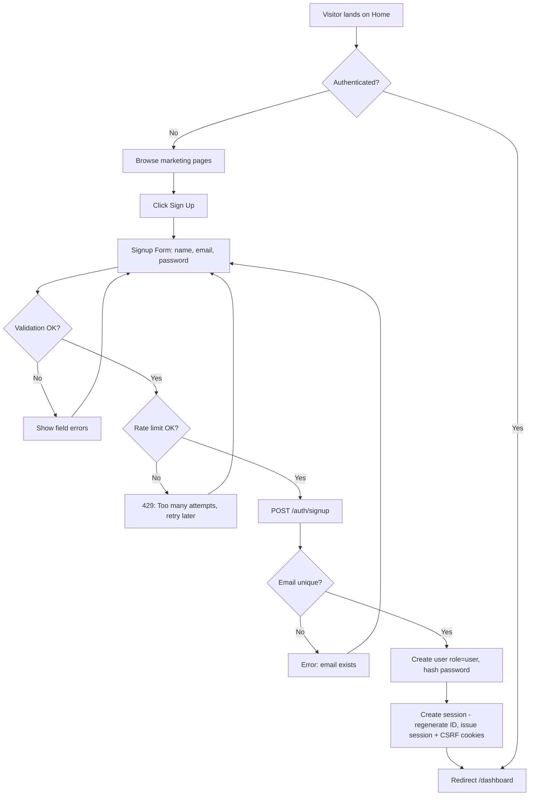

### Steps

1. Visitor navigates marketing site
2. Clicks **Get Started** or **Sign Up**
3. Completes signup form
4. Frontend checks signup is not currently rate-limited (handled server-side; UI surfaces `429` if hit)
5. Backend creates user (`role: user`), hashes password
6. Backend creates session, **regenerates session ID**, issues `ssf_session` (HttpOnly) and `ssf_csrf` (readable) cookies
7. Redirect to `/dashboard`

**v2 additions:** signup is now rate-limited (5 attempts / 15 min / IP, per TRD §4.7); session creation issues a CSRF cookie alongside the session cookie.

---

## 5. Flow: User Login

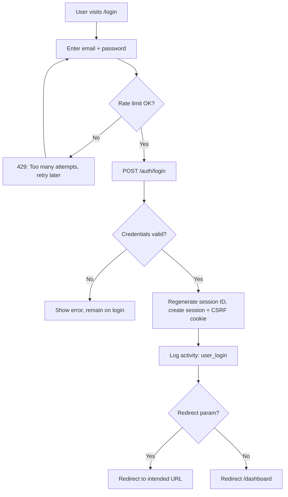

### Session Guard (App Routes)

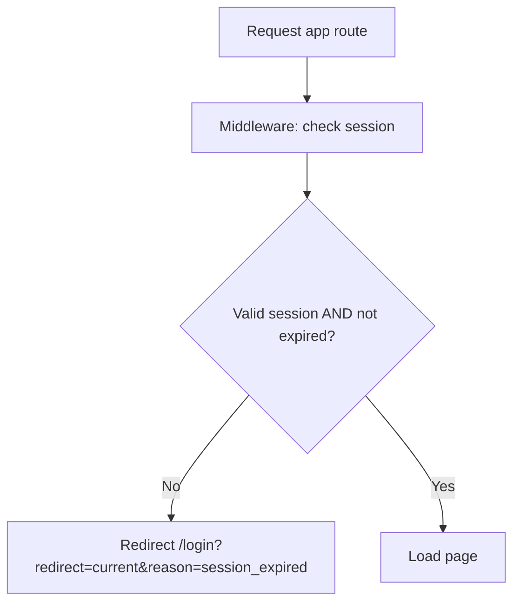

**v2 additions:**
- Login attempts rate-limited per §4.7 of TRD (5 / 15 min / IP), independent counter from admin login.
- Session ID is regenerated on every successful login (fixation prevention).
- Session validity check now explicitly includes expiry (`expires_at`) — fixed expiry, no sliding renewal (see §16.1).

---

## 6. Flow: Admin Login

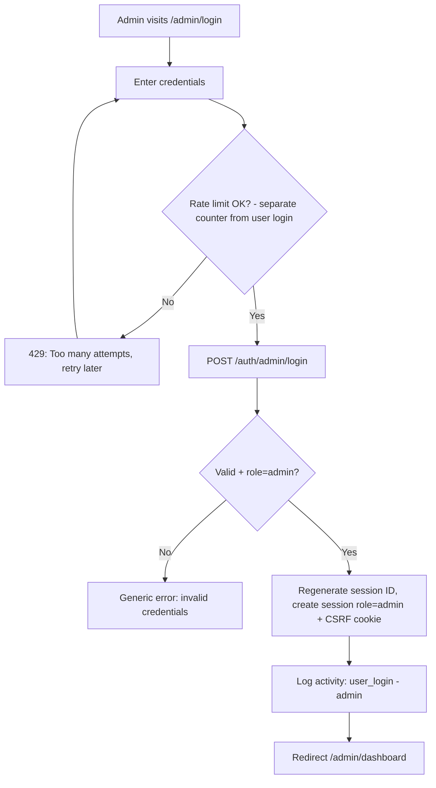

**Notes:**
- Non-admin users attempting admin login receive a generic error (no role enumeration) — unchanged from v1.
- **v2 addition:** admin login attempts are rate-limited with a counter separate from `/auth/login`, so an attacker hammering `/admin/login` does not affect (or get masked by) regular user login limits, and vice versa.

---

## 7. Flow: Dashboard → Plugin Library → Workspace

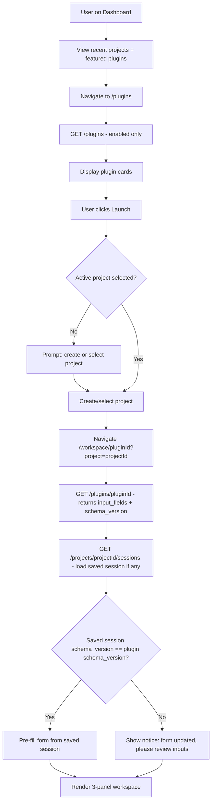

### Dashboard Quick Actions

- **Continue last session** → `/workspace/{pluginId}?project={lastProjectId}`
- **New project** → modal → `/projects`
- **Browse plugins** → `/plugins`

**v2 additions:**
- Plugin detail load now returns `schema_version` alongside `input_fields`.
- When restoring a saved workspace session, the frontend compares the session's stored `schema_version` to the plugin's current value. A mismatch does **not** block the user — it shows a non-blocking notice and leaves fields editable, per TRD §7.4.

**MVP plugin library:** 12 enabled plugins loaded from `GET /plugins` (see PRD §14). Dashboard shows the first three as highlights; `/plugins` lists all enabled cards with Lucide icons.

### Recommended Multi-Plugin Workflows

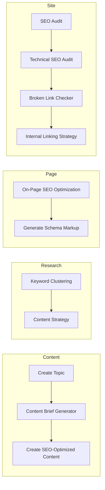

Users run each step as a separate workspace session; outputs can be copied into the next plugin's inputs or saved to a project.

---

## 8. Flow: Plugin Execution

```mermaid
sequenceDiagram
    participant U as User
    participant FE as Frontend
    participant API as FastAPI
    participant DB as PostgreSQL
    participant Stub as Stub Executor

    U->>FE: Fill input form + click Run (or Cmd/Ctrl+Enter)
    FE->>FE: Zod validate inputs
    FE->>API: POST /execute/{plugin_id} (incl. schema_version, X-CSRF-Token)
    API->>API: Validate CSRF token
    API->>DB: Load plugin + prompts
    API->>API: Compare schema_version
    alt schema_version mismatch
        API-->>FE: 409 SCHEMA_OUTDATED
        FE->>FE: Prompt user to refresh form
    else schema_version OK
        API->>API: Pydantic validate inputs
        API->>DB: INSERT executions row (status=running)
        API->>Stub: load prompt (stub)
        Stub-->>API: prompt text or empty
        API->>Stub: execute (mock delay ~1.5s)
        Stub-->>API: mock output
        API->>DB: UPDATE executions row (status=completed, result)
        API->>DB: UPSERT workspace_sessions (inputs, schema_version)
        API->>DB: Log activity: plugin_execute (incl. execution_id)
        API-->>FE: output + workflow_steps + execution_id
        FE->>FE: Render in center panel; show "Completed in Xs"
        U->>FE: Click Save Output
        FE->>API: POST /outputs (incl. X-CSRF-Token)
        API->>DB: Insert outputs row (incl. schema_version in input_snapshot)
        API-->>FE: saved confirmation
        FE->>FE: Toast: "Saved to {project name}"
        FE->>FE: Update right panel saved results
    end
```

### Execution States (UI)

| State | Center Panel Behavior |
|-------|----------------------|
| `idle` | Empty state ("Fill in the inputs on the left to get started") or previous messages |
| `validating` | Inline field errors if invalid |
| `running` | Stepper animates through Validate → Load → Execute; "Preview mode" badge visible |
| `completed` | Output rendered; stepper collapses to "Completed in Xs"; save/export enabled |
| `schema_outdated` *(new)* | Non-blocking banner: "This plugin's form has been updated — please review your inputs"; Run remains available after review |
| `error` | Error message + retry CTA; failed `executions` row recorded with `error_message` |

**v2 additions:**
- CSRF token required on `POST /execute` and `POST /outputs`.
- Every execution writes an `executions` row at start (`running`) and on completion (`completed`/`failed`) — this is now mandatory, not optional.
- `workspace_sessions` is upserted on every **successful** execution (not only on explicit save) — formalizes "resume session" behavior.
- New `schema_outdated` state for the 409 response path.
- Stepper persists after completion, showing elapsed time, instead of disappearing.

---

## 9. Flow: Project Management

```mermaid
flowchart TD
    A[User on /projects] --> B[List projects - GET /projects]
    B --> C{Action?}
    C -->|Create| D[Modal: project name]
    D --> D1{Name unique for user?}
    D1 -->|No| D2[Error: project name already exists]
    D2 --> D
    D1 -->|Yes| E["POST /projects (X-CSRF-Token)"]
    E --> B
    C -->|Rename| F[Inline edit name]
    F --> G["PATCH /projects/id (X-CSRF-Token)"]
    G --> B
    C -->|Delete| H[Confirm dialog]
    H --> I["DELETE /projects/id (X-CSRF-Token) - soft delete, deleted_at set"]
    I --> B
    C -->|Open| J[/projects/id detail]
    J --> K[View outputs + sessions]
    K --> L[Resume workspace session]
```

### Project ↔ Workspace Relationship

- Every execution is optionally tied to `project_id`
- **Saved sessions** (left sidebar): last inputs + `schema_version` + timestamp per plugin within project, upserted on every successful execution
- **Saved outputs** (right sidebar + project detail): persisted `outputs` records, created only on explicit "Save Output"

**v2 additions:**
- Project name uniqueness per user is now enforced and surfaced as an inline error on create (matches `idx_projects_user_name` unique index in schema).
- Project delete is explicitly soft (`deleted_at` set); a 30-day retention window applies before hard delete cascades to `outputs` (formal resolution of v1's open question — see PRD §13).
- All mutating requests (create/rename/delete) include `X-CSRF-Token`.

---

## 10. Flow: Workspace Panels

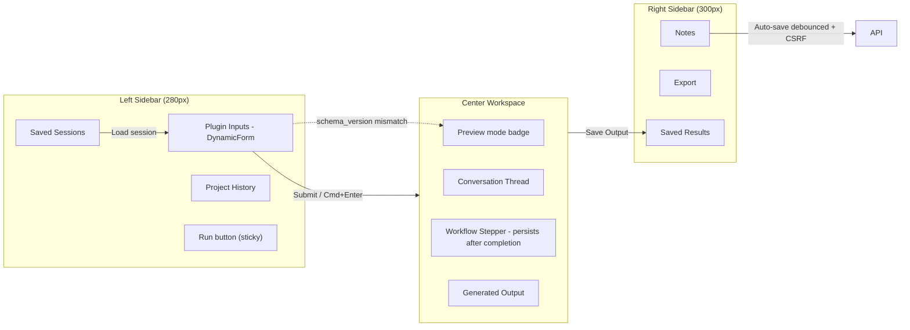

### Left Sidebar Interactions

1. **Plugin Inputs** — dynamic form from plugin schema (versioned via `schema_version`)
2. **Project History** — list of outputs for current project
3. **Saved Sessions** — click to restore inputs into form; flags non-blocking notice if `schema_version` differs
4. **Run button** — sticky to bottom of left panel, always visible regardless of form length

### Center Panel Interactions

1. "Preview mode" badge — persistent, indicates AI execution is stubbed
2. User message bubble (summary of submitted inputs)
3. Workflow stepper — animates during execution, collapses to a completion summary ("Completed in 2.1s") afterward rather than disappearing
4. Assistant output (markdown render, sanitized)

### Right Sidebar Interactions

1. **Notes** — freeform text, debounced save (with CSRF token) to `workspace_sessions.notes`; "Saved" indicator with checkmark
2. **Export** — copy markdown, download JSON (MVP)
3. **Saved Results** — list outputs for current plugin+project, each with timestamp and preview snippet

---

## 11. Flow: Admin — Create Plugin

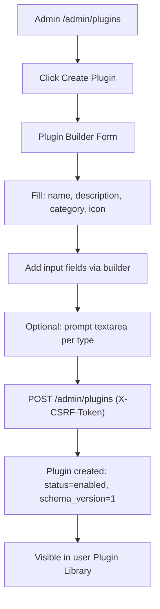

### Edit Plugin (Schema Version)

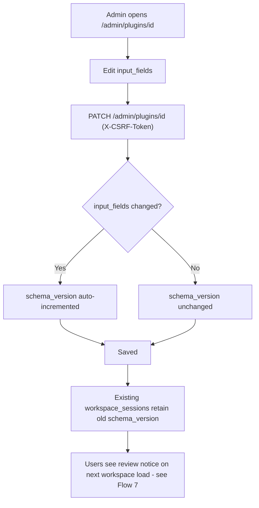

### Enable / Disable

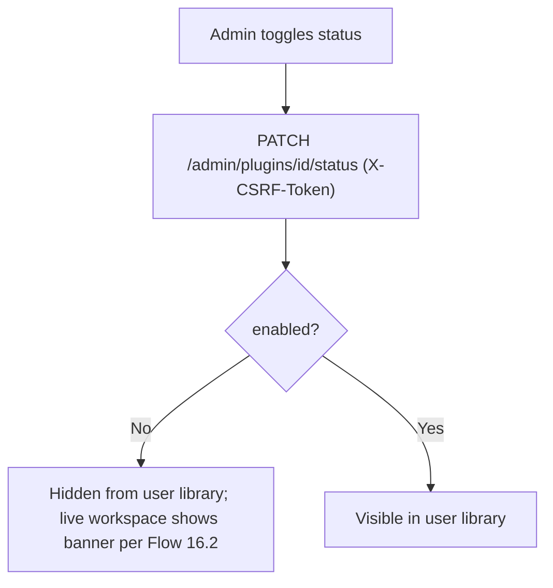

**v2 additions:** all admin mutations require `X-CSRF-Token`. Editing `input_fields` now auto-increments `schema_version`, which is the mechanism that drives the "form updated" notice in Flow 7.

---

## 12. Flow: Admin — User Management

```mermaid
flowchart TD
    A[/admin/users] --> B[List all users - GET /admin/users]
    B --> C{Action}
    C -->|Create| D[Form: name, email, password, role]
    D --> E["POST /admin/users (X-CSRF-Token)"]
    C -->|Edit| F["PATCH /admin/users/id (X-CSRF-Token)"]
    C -->|Deactivate| G["DELETE /admin/users/id (X-CSRF-Token) - soft delete: deleted_at"]
    E --> B
    F --> B
    G --> B
```

---

## 13. Flow: Admin — Prompt Management

```mermaid
flowchart TD
    A[/admin/prompts] --> B[Select plugin from list]
    B --> C[View prompt types: primary, system, followup]
    C --> D[Edit prompt content]
    D --> E["PUT /admin/plugins/id/prompts (X-CSRF-Token)"]
    E --> F[Saved to prompts table]
    F --> G[MVP: execution may still use stub if empty]
```

*(Unchanged from v1 — prompt editing does not affect `schema_version`, since prompts are independent of `input_fields`.)*

---

## 14. Flow: Admin — Dashboard *(new)*

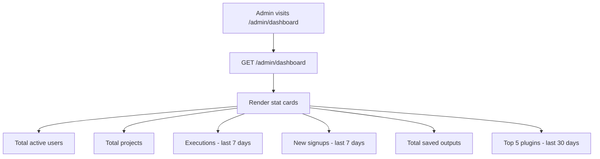

All values are aggregated from `users`, `projects`, `executions`, and `outputs` — no new tables. See PRD §8.9 / TRD §5.8 for the full response shape.

---

## 15. Flow: Activity Logging & Execution Records

Events written automatically (not user-initiated):

| Event | Trigger | Logged Fields |
|-------|---------|---------------|
| `user_login` | Successful login (user or admin) | user_id, role, IP, timestamp |
| `user_logout` | Logout | user_id |
| `user_signup` | Registration | user_id |
| `project_create` | POST /projects | user_id, project_id |
| `project_rename` | PATCH /projects/id | user_id, project_id, old_name, new_name |
| `project_delete` | DELETE /projects | user_id, project_id |
| `plugin_launch` | Workspace mount | user_id, plugin_id |
| `plugin_execute` | POST /execute | user_id, plugin_id, project_id, **execution_id** |
| `output_save` | POST /outputs | user_id, output_id |
| `admin_user_update` | Admin user PATCH | admin_id, target_user_id |
| `admin_plugin_update` | Admin plugin PATCH | admin_id, plugin_id, **schema_version_changed (bool)** |

### Execution Records *(new layer, parallel to activity logs)*

| Field | Description |
|-------|-------------|
| `execution_id` | Unique per run |
| `status` | `pending` → `running` → `completed` \| `failed` |
| `inputs` | Full snapshot of submitted inputs |
| `result` / `error_message` | Populated on completion or failure |
| `started_at` / `completed_at` | Timing, used for "Completed in Xs" UI and performance metrics |

Retained 30 days (per backend-schema §9). Powers admin dashboard stats (Flow 14) and is the foundation for Phase 5 retry/streaming — no schema change needed when that lands.

Admin views activity logs at `/admin/logs` with filters: user, action, date range.

---

## 16. Flow: Logout

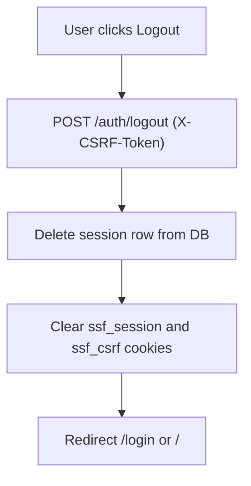

---

## 17. Error & Edge Case Flows

### 17.1 Session Expired

1. API returns `401`
2. Frontend clears auth store
3. Redirect to `/login?redirect={path}&reason=session_expired`

**v2 clarification:** session expiry is **fixed/hard** (no sliding renewal). A session created with a 7-day TTL expires exactly 7 days after creation regardless of activity. Users must re-authenticate; there is no "your session is about to expire" warning in MVP.

### 17.2 Plugin Disabled Mid-Session

1. User has workspace open for plugin
2. Admin disables plugin
3. On next execute: API returns `403 PLUGIN_DISABLED`
4. UI shows banner; inputs read-only

*(Unchanged from v1.)*

### 17.3 Project Deleted While in Workspace

1. Execute with stale `project_id` returns `404`
2. UI prompts user to select another project

*(Unchanged from v1. Note: soft-deleted projects are excluded from `project_id` validation immediately, even though hard delete is deferred 30 days — see PRD §13.)*

### 17.4 Unauthorized Admin Access

1. User role accesses `/admin/*`
2. Middleware redirects to `/dashboard` or returns `403`

*(Unchanged from v1.)*

### 17.5 Schema Version Mismatch on Execute *(new)*

1. User restores a saved session whose `schema_version` differs from the plugin's current version
2. Frontend shows a non-blocking notice but allows the user to proceed
3. If the user clicks Run anyway and the backend still detects a mismatch (race condition — admin edited plugin between page load and run), API returns `409 SCHEMA_OUTDATED`
4. Frontend re-fetches the current plugin schema, re-renders the form (preserving any values that still map to existing fields), and shows: "This plugin's form was updated. Please review your inputs and try again."

### 17.6 CSRF Token Missing or Invalid *(new)*

1. Any non-GET `/api/v1/*` request arrives without a valid `X-CSRF-Token` matching the `ssf_csrf` cookie
2. API returns `403 CSRF_TOKEN_INVALID`
3. Frontend's API client wrapper (`lib/api.ts`) is responsible for always attaching this header from the cookie, so this should only surface in practice if cookies are blocked or the session is stale — in which case the frontend treats it like a session-expired redirect

### 17.7 Rate Limit Exceeded *(new)*

1. User exceeds 5 attempts in 15 minutes on `/auth/login`, `/auth/admin/login`, or `/auth/signup`
2. API returns `429 RATE_LIMITED` with `Retry-After` header
3. UI shows: "Too many attempts. Please try again in {n} minutes." and disables the submit button until the retry window passes (client-side countdown is a UX nicety, not a security control — server enforces the actual limit)

---

## 18. Navigation Matrix

| From | To | Trigger |
|------|-----|---------|
| Home | Signup | CTA button |
| Home | Login | Nav link |
| Login | Dashboard | Success |
| Signup | Dashboard | Success |
| Dashboard | Plugins | Sidebar / card |
| Plugins | Workspace | Launch + project |
| Workspace | Plugins | Back nav |
| Projects | Workspace | Resume session |
| Any app | Profile | User menu |
| Admin login | Admin dashboard | Success |
| **Admin dashboard** *(new)* | **Admin logs / users / plugins** | **Stat card click-through (optional, recommended for Phase 4)** |

---

## 19. Summary of Changes from v1.0

| Area | Change | Why |
|------|--------|-----|
| Signup, login, admin login | Added rate-limit branches to flow diagrams; admin login uses a separate counter | Reflects TRD §4.7 expanded rate limiting |
| Login, signup, admin login | Session ID regeneration and CSRF cookie issuance now shown explicitly | Reflects TRD §4.2/§4.6 |
| Workspace launch (Flow 7) | Added `schema_version` comparison step when restoring saved sessions | Implements PRD's plugin schema versioning |
| Plugin execution (Flow 8) | Added CSRF validation, `schema_version` check (409 path), mandatory `executions` record write, `workspace_sessions` upsert on every success | Aligns with TRD v2 execution pipeline (§6.3) |
| Execution states table | Added `schema_outdated` state | New 409 response path needs UI representation |
| Workspace panels (Flow 10) | Sticky Run button, persistent stepper, "Preview mode" badge placement called out | Matches UI/UX brief v2 §6.3 |
| Project management (Flow 9) | Added project-name-uniqueness error path; clarified soft-delete + 30-day retention | Resolves v1 open question, matches schema constraint |
| Admin plugin edit (Flow 11) | New sub-flow showing `schema_version` auto-increment on `input_fields` change | Implements schema versioning end-to-end |
| Admin dashboard (Flow 14) | New flow added | Dashboard previously had no defined flow or data source |
| Activity logging (Flow 15) | Added `executions` as a parallel record layer; `plugin_execute` now references `execution_id` | Matches TRD's mandatory executions table |
| Error flows (§17) | Added schema-mismatch (17.5), CSRF failure (17.6), rate-limit (17.7); clarified hard session expiry (17.1) | Covers new failure modes introduced by v2 security/versioning changes |
| Navigation matrix | Added optional admin dashboard click-through | Minor UX improvement, non-blocking |

All existing routes, page purposes, and core user journeys from v1 are preserved unchanged — v2 adds detail for security (CSRF, rate limiting, session regeneration), schema versioning, and the execution-record layer, all of which were already implied or required by the updated PRD/TRD/schema but not previously reflected in the flow diagrams.

---

## 20. Document History

| Version | Date | Changes |
|---------|------|---------|
| 1.0 | 2026-06-11 | Initial app flow document |
| 2.0 | 2026-06-11 | Added CSRF, rate limiting, session regeneration, schema versioning, mandatory execution records, admin dashboard flow, and corresponding error/edge-case flows |
| 2.1 | 2026-06-11 | Added 12-plugin library note, recommended multi-plugin workflow diagram (content, research, page, site) |
| 2.1 | 2026-06-11 | Added 12-plugin library note, recommended multi-plugin workflow diagrams |